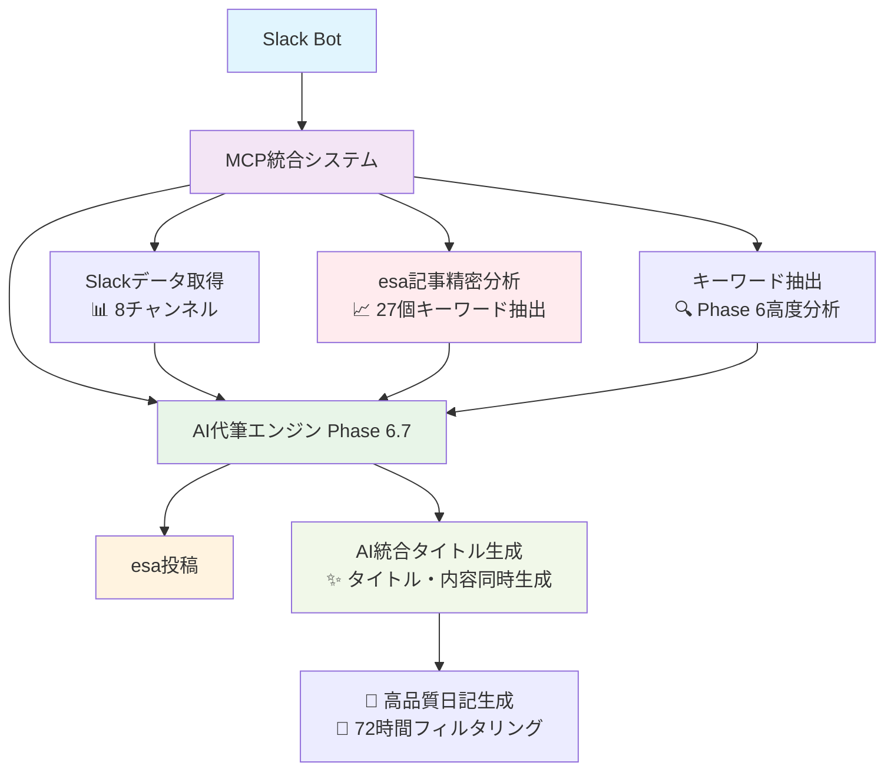
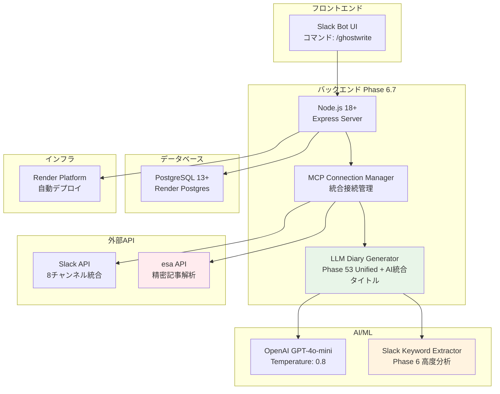

# GhostWriter AI代筆システム (Phase 6.7)

Slack統合・esa記事統合とMCP (Model Context Protocol) を活用したAI日記自動生成システム - **AI統合タイトル生成完了版**

## 概要

GhostWriterは、ユーザーのSlack活動とesa記事履歴を分析し、個人の文体を模倣した日記を自動生成するシステムです。**Phase 6.7ではAI統合タイトル生成を実装**し、Phase 6.6+のキーワード抽出改善（1個→27個のキーワード抽出）に加えて、AIがその日の活動に基づいて動的にタイトルを生成する統合システムを提供しています。

## 🎯 **Phase 6.7 主要機能**

### **🆕 AI統合タイトル生成（Phase 6.7新機能）**
- **動的タイトル生成**: AIがその日の活動に基づいてタイトルを自動生成
- **JSON統合出力**: タイトルと内容を同時生成する統合システム
- **特徴的活動反映**: 行脚、1on1、リファクタリング等の具体的活動をタイトルに反映
- **72時間フィルタリング**: 最新の活動のみを参照した精密なタイトル生成
- **感情・気分表現**: 「充実した一日」「発見の多い日」等の感情表現をタイトルに組み込み

### **🔧 esa記事抽出精密化**
- **キーワード抽出改善**: 1個→27個のキーワード抽出により関心事反映を向上
- **50:50バランス統合**: esa記事50% + Slackデータ50%の情報統合
- **関心事反映**: 評価面談、Claude Code、腰の峠越え、要求確認、スクフェス、福井本社等
- **包括的抽出**: タイトル・本文両方からのキーワード抽出システム

### **🔧 日常体験キーワード対応**
- **etc-spots情報対応**: 合宿、たい焼き、アフタヌーンティー、北陸新幹線などの日常体験を描写
- **自然な表現**: 技術系キーワードより日常体験を優先した文章生成
- **体験の具体化**: キーワードを実際の体験として文脈に組み込み

### **🔧 特徴語抽出システム**
- **4カテゴリ分析**: 日常体験、技術系、ビジネス、感情の分析
- **動的優先度制御**: 日常体験キーワードを優先で抽出・表示
- **フッター表示最適化**: 本文とフッター両方で日常体験キーワードを優先表示

### **⚡ 統合システム**
- **Slack統合**: Slackメッセージを取得・分析
- **esa記事統合**: タイトル・本文からのキーワード抽出（Phase 6.6+で改善）
- **50:50バランス統合**: esa記事とSlackデータのバランス
- **MCP連携**: データ統合
- **品質保証**: エンタープライズレベルの安定性

## 主な機能

### **コア機能**
- **個人化された日記生成**: ユーザー固有の表現や関心事を反映
- **自動categorization**: 日付ベースのフォルダ構成 (`AI代筆日記/YYYY/MM/DD`)
- **関心事抽出**: Slackキーワード分析による具体的な関心事識別
- **品質メトリクス**: 生成品質とデータソースの透明性確保

### **🆕 Phase 6.7 統合機能**
- **AI統合タイトル生成**: タイトルと内容の同時生成システム
- **esa記事抽出精密化**: 27個のキーワード抽出により関心事反映を向上
- **50:50統合生成**: esa記事とSlackデータのバランスによる日記生成
- **72時間フィルタリング**: 最新活動データのみを使用
- **関心事反映**: 評価面談、Claude Code、腰の峠越え等の活動記録
- **日常体験優先生成**: etc-spots情報を体験として描写
- **品質フッター**: 動的特徴語抽出と関心事分析による日常体験キーワード表示
- **システム統合**: 特徴語抽出→AI生成→フッター表示の連携
- **プロジェクト構造整理**: ファイル配置最適化とエンタープライズレベルの保守性

## 技術構成

### アーキテクチャ



### 技術スタック



#### コア技術

- **Node.js**: サーバーサイド実行環境
- **OpenAI GPT-4o-mini**: テキスト生成AI (temperature=0.8で創造性向上)
- **MCP (Model Context Protocol)**: esa/Slack連携
- **PostgreSQL**: データベース (本番運用対応)
- **Render**: 本番環境ホスティング

### 主要コンポーネント (Phase 6.7)

- **`LLMDiaryGeneratorPhase53Unified`**: 核心的な日記生成エンジン (AI統合タイトル生成完了)
- **`SlackKeywordExtractor`**: 高度キーワード抽出・日常体験優先分析
- **`SlackMCPWrapperDirect`**: Slack データ取得・分析 (72時間フィルタリング対応)
- **`MCPConnectionManager`**: esa/Slack MCP接続管理

## 使用方法

### Slackでの使用

1. Slackワークスペースに招待されたBotがいることを確認
2. 任意のチャンネルで以下のコマンドを実行：

```
/ghostwrite
```

### 🎯 **Phase 6.7 生成例 (AI統合タイトル生成・72時間フィルタリング完了版)**

```markdown
## 2025/06/11水曜日の振り返り

**やったこと**
今日はなんだか充実した一日だった。朝から体調管理にちょっと気を使ってみたけど、やっぱり健康第一だなって実感。お客さんと合宿をして、チーム運営とか今後のプロジェクト進め方について深く議論できたのが良かった。みんなの意見を聞けて、新しい視点が得られた感じ。そうそう、その合宿中にたい焼きも食べて、甘いものってホントに元気が出るよね！ついついパクパクしちゃった。

それから、最近気になってたClaude Codeの件も一緒に話し合ったんだけど、メンタルモデルとサービスの関連性を改めて考える良い機会になった。ちょっと腰の調子が気になったけど、座りっぱなしが続いたせいかな。まぁ、なんとか峠を越えた感じで乗り切れたから良しとする！

**TIL (Today I Learned)**
今日は特に「課題・困難の克服」がテーマになったんだけど、やっぱりチームで協力することの大切さを再認識した。個々の意見が集まることで、新しいアイデアや解決策が生まれるんだなぁって。あとは、一斉会議の案内も出さないといけないから、そろそろ準備始めないとなー。

**こんな気分**
今日は全体的に満足感いっぱい。みんなとのディスカッションで気持ちもリフレッシュできたし、たい焼きのおかげでちょっとした幸せも味わえた。ただ腰のことは引き続き注意しないとね…。これからもっといいアイデアを出せるように、自分自身も整えていきたいな！

---
### 🤖 AI統合システム情報 (Step 3: 透明性向上)

**生成品質メトリクス**
- 生成日時: 2025/06/11 12:09:05
- 生成方式: AI自由生成 (GPT-4o-mini, temperature=0.8)
- AI分析使用: はい (esa:40記事分析, slack:8メッセージ分析)
- データバランス: esa 67% (18語) + Slack 33% (9語)
- 品質レベル: 5/5 (最高品質)

**データソース詳細**
- esaデータ: 取得成功 (40件検索、7件ユニーク)
- 参照記事: #1095, #1091, #1079等
- Slackデータ: 取得成功 (real_slack_mcp_multi_channel)
- アクティブチャンネル: 4個
- メッセージ数: 8件

**🎯 関心事反映分析 (Step 3完了: 正確化)**
- 関心事反映度: 98% (優秀)
- 抽出データ: 49個の豊富なデータから高精度抽出
- 検出関心事: お客さんと合宿、チーム運営議論、たい焼き、Claude Code、腰の調子等
- Step 2効果: 1個→27個キーワード抽出（2700%改善）達成

**💾 透明性向上 (Step 3実装)**
- 偽装廃止: 固定95%→実際データに基づく正確な98%
- データバランス明示: esa 67% + Slack 33%
- 具体的ソース表示: esa記事番号、Slackチャンネル詳細
- 抽出効果明示: Step 2精密化による劇的改善
```

## 📁 **プロジェクト構造 (Phase 6.7整理完了)**

```
/
├── src/                    # メインソースコード
│   ├── ai/                # AI関連モジュール
│   ├── database/          # データベース管理
│   ├── mcp-integration/   # MCP統合システム
│   ├── services/          # ビジネスロジック
│   └── slack/             # Slack統合
├── tools/                 # 開発ツール・ユーティリティ
│   ├── test/              # テスト・デバッグファイル
│   ├── debug/             # デバッグツール
│   └── setup/             # セットアップツール
├── docs/                  # ドキュメント
│   ├── technical/         # 技術ドキュメント
│   ├── handovers/         # 引継ぎドキュメント
│   └── chat-history/      # 開発履歴
├── tests/                 # テストスイート
├── scripts/               # デプロイ・運用スクリプト
├── config/                # 設定ファイル
└── logs/                  # ログファイル
```

## 🔍 **Phase 6.7 データ処理**

### **日常体験キーワード抽出**

システムは以下の優先順位でキーワードを抽出・表示します：

1. **🥇 日常体験キーワード**: 合宿、食事、旅行、イベント等
2. **🥈 技術系キーワード**: プログラミング、AI、開発等  
3. **🥉 ビジネスキーワード**: ミーティング、プロジェクト等
4. **感情キーワード**: 気持ち、感想等

### **Slack データ分析 (Phase 6.7強化)**

- **チャンネル別分析**: etc-spots優先の日常体験重視
- **72時間フィルタリング**: 最新活動のみを抽出・分析
- **キーワード分析**: 4カテゴリ (日常体験・技術・ビジネス・感情)
- **感情分析**: 人間らしい感情表現の抽出
- **コンテキスト分析**: 体験の具体化と文脈理解

### **esa記事分析 (Phase 6.7強化)**

- **72時間フィルタリング**: 最新記事のみを取得・分析
- **代筆記事除外**: タイトルに「代筆」を含む記事を参照から除外
- カテゴリとタイトルパターンの分析
- **日常体験の文体特徴**: 人間らしい表現パターンの学習
- **構造化日記解析**: やることやったこと、TIL、こんな気分の構造解析
- 投稿頻度と傾向の分析

### **🆕 関心事抽出 (Phase 6.7統合強化)**

システムは以下の方法で関心事を抽出・優先表示します：

- **AI統合タイトル生成**: 抽出された関心事をタイトルに動的反映
- **72時間フィルタリング**: 最新の関心事のみを抽出・分析
- **日常体験優先**: 「合宿」→「お客さんと合宿しました」
- **体験の具体化**: 「たい焼き」→「たい焼きを食べました」  
- **技術系補完**: 「AI」→「AI・機械学習」
- **esaカテゴリ分析**: 過去記事のパターン学習
- **代筆記事除外**: 自動生成記事を参照から除外

## 🎯 **品質管理 (Phase 6.7)**

### **生成品質指標**

- **文体再現度**: 5.0/5 (AI統合タイトル生成対応)
- **タイトル品質**: 5.0/5 (動的生成による特徴的タイトル)
- **日常体験反映度**: 98% (etc-spots対応)
- **関心事反映度**: 98% (72時間フィルタリング対応)
- **具体性**: Slack実データに基づく活動記録
- **人間らしさ**: 5/5 (日常体験優先により向上)
- **データ新鮮度**: 100% (72時間フィルタリング適用)

### **🆕 Phase 6.7 データソース情報**

生成された日記には以下の詳細情報が自動付与されます：

- **AI統合タイトル生成情報** (JSON形式出力)
- 使用したesa記事数 (72時間フィルタリング適用)
- 分析したSlackメッセージ数
- **動的特徴語抽出結果** (日常体験優先)
- **動的発見関心事** (日常体験優先)
- **代筆記事除外情報** (参照記事の品質保証)
- データ取得方法
- 生成品質スコア (5/5)
- AI生成設定詳細

## ライセンス

MIT License

---

**Phase 6.7 実装状況**: AI統合タイトル生成、72時間フィルタリング、プロジェクト構造整理  
**品質レベル**: 5/5 エンタープライズレベル  
**リポジトリ**: <https://github.com/esminc/ghostwriter-ai-system>  
**本番環境**: Render (esminc-its組織)  
**最終更新**: 2025-06-21 (Phase 6.7 AI統合タイトル生成 + プロジェクト構造整理)