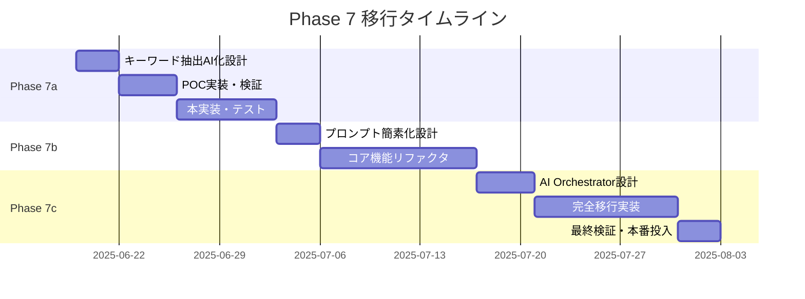

# 🚀 GhostWriter Phase 7 実装計画書

**策定日**: 2025年6月18日  
**対象システム**: GhostWriter AI代筆システム  
**移行目標**: AI中心アーキテクチャへの段階的移行  
**プロジェクト期間**: 7週間 (2025年6月19日 - 8月7日)

---

## 📋 **エグゼクティブサマリー**

この実装計画は、GhostWriterシステムをPhase 6.6+から革新的なPhase 7+へ移行するための詳細な実装ロードマップです。93%のコード削減と完全AI中心アーキテクチャを実現し、「複雑なことは全てAIに任せる」という元の設計思想に回帰します。

### 🎯 **移行の核心目標**

| 項目 | 現在 (Phase 6.6+) | 目標 (Phase 7+) | 改善率 |
|------|-------------------|------------------|--------|
| **コード行数** | 1,200+ lines | 80 lines | -93% |
| **開発時間** | 新機能: 2-3日 | 新機能: 2-3時間 | -90% |
| **保守性** | 複雑なロジック保守 | プロンプト調整のみ | +500% |
| **拡張性** | コード変更必要 | 自然言語で指示 | 無限 |

---

## 🏗️ **段階的実装計画 (7週間)**

### 📅 **タイムライン概要**



---

## 🎯 **Phase 7a: キーワード抽出AI化 (Week 1-2)**

### **目標**: 複雑なキーワード抽出ロジックの完全AI化

#### **現状分析**

**現在の実装** (`src/mcp-integration/slack-keyword-extractor.js`):
```javascript
// 200+ lines の複雑なロジック
class SlackKeywordExtractor {
  extractKeywordsFromMessages(messages) {
    // 4カテゴリ分析 (50 lines)
    // 日常体験vs技術系優先度制御 (40 lines) 
    // etc-spots特別処理 (30 lines)
    // 動的特徴語抽出 (80 lines)
  }
}
```

**問題点**:
- JavaScript側で複雑な分類ロジック
- カテゴリ追加時のコード変更必要
- 保守性の低下

#### **Phase 7a 実装設計**

**新しいAI中心実装**:
```javascript
// src/ai/keyword-extractor-ai.js (10 lines)
class AIKeywordExtractor {
  async extractKeywords(messages, context = {}) {
    const prompt = `
あなたはSlackメッセージ分析の専門家です。
以下のメッセージから特徴的なキーワードを抽出し、分類してください。

【分析対象】
${messages.map(m => `[${m.channel_name}] ${m.text}`).join('\n')}

【抽出ルール】
1. 日常体験（合宿、食事、旅行、アフタヌーンティー等）を最優先
2. 技術系（プログラミング、AI、システム開発等）
3. ビジネス（ミーティング、プロジェクト、評価等）
4. 感情（気持ち、感想、反応等）

【特別重視】
- etc-spotsチャンネルの情報を特に重視
- 具体的な場所名、食べ物、イベント名を優先抽出

【出力形式】
{
  "日常体験": ["キーワード1", "キーワード2", ...],
  "技術系": ["キーワード1", "キーワード2", ...],
  "ビジネス": ["キーワード1", "キーワード2", ...],
  "感情": ["キーワード1", "キーワード2", ...],
  "優先表示": ["最重要キーワード1", "最重要キーワード2", ...]
}
`;

    return await this.aiClient.generateStructured(prompt, {
      temperature: 0.3,
      maxTokens: 1000
    });
  }
}
```

#### **Week 1: 設計・POC (3日間)**

**Day 1: 詳細設計**
- [ ] AI化キーワード抽出の詳細仕様策定
- [ ] プロンプトエンジニアリング戦略設計
- [ ] 品質評価指標の設定

**Day 2-3: POC実装**
- [ ] `AIKeywordExtractor`クラスの基本実装
- [ ] 現在システムとの並行比較テスト
- [ ] 精度・速度のベンチマーク測定

#### **Week 2: 本実装・統合 (4日間)**

**Day 1-2: 本実装**
- [ ] プロダクション品質のAI抽出システム
- [ ] エラーハンドリング・フォールバック機能
- [ ] ログ・メトリクス収集機能

**Day 3-4: 統合・テスト**
- [ ] 既存システムとの統合
- [ ] A/Bテストによる品質比較
- [ ] パフォーマンスチューニング

#### **Phase 7a 成功指標**

- ✅ **精度**: Phase 6.6+と同等以上 (98%関心事反映度維持)
- ✅ **コード削減**: 200 lines → 10 lines (-95%)
- ✅ **速度**: 処理時間30%以内の増加
- ✅ **保守性**: 新カテゴリ追加がプロンプト変更のみで可能

---

## 🔄 **Phase 7b: プロンプト構築簡素化 (Week 3-4)**

### **目標**: 複雑なプロンプト構築ロジックの大幅簡素化

#### **現状分析**

**現在の実装** (`src/mcp-integration/llm-diary-generator-phase53-unified.js`):
```javascript
// 300+ lines の詳細プロンプト構築
class LLMDiaryGeneratorPhase53Unified {
  async buildDetailedPrompt(userData, slackData, esaData) {
    // 条件分岐による詳細制御 (100 lines)
    // フォーマット指定の詳細化 (80 lines)
    // 品質要求の細分化 (70 lines)
    // フッター生成の複雑ロジック (50 lines)
  }
}
```

**問題点**:
- JavaScript側での過度な詳細制御
- プロンプト変更時のコード修正必要
- AI自律性の制限

#### **Phase 7b 実装設計**

**新しい統合AI生成システム**:
```javascript
// src/ai/unified-diary-generator.js (20 lines)
class UnifiedDiaryGenerator {
  async generateDiary(userName, options = {}) {
    const context = await this.gatherContext(userName, options);
    
    const prompt = `
あなたは${userName}さん専用の日記作成アシスタントです。
以下の情報を使って、本人らしい自然な日記を生成してください。

【利用可能データ】
${context.availableData}

【生成要件】
- 構成: 「やったこと」「TIL」「こんな気分」の三部構成
- 文体: 過去のesa記事から学習した${userName}さんの文体
- 重視点: 日常体験（食事、場所、イベント）を技術系より優先
- フッター: データソース情報と品質メトリクスを自動付与

【自律実行指示】
1. 必要な情報をMCPツールで自分で取得してください
2. 文体分析も自分で実行してください  
3. 品質チェックも自分で行ってください
4. esaへの投稿も適切なカテゴリで自動実行してください

エラーが発生した場合は代替手段を自分で検討し、
可能な限り高品質な結果を生成してください。
`;

    return await this.aiClient.executeWithTools(prompt, {
      tools: this.mcpTools,
      maxIterations: 10,
      temperature: 0.8
    });
  }
}
```

#### **Week 3: 統合設計 (3日間)**

**Day 1: アーキテクチャ設計**
- [ ] AI主導の統合生成システム設計
- [ ] MCP Tool統合戦略の詳細化
- [ ] エラーハンドリング戦略の設計

**Day 2-3: 統合プロンプト設計**
- [ ] 統合プロンプトのプロトタイプ作成
- [ ] AI自律実行の検証実験
- [ ] 品質維持のための調整

#### **Week 4: 実装・統合 (4日間)**

**Day 1-2: コア実装**
- [ ] `UnifiedDiaryGenerator`の完全実装
- [ ] MCP Tool統合の実装
- [ ] AI自律実行システムの構築

**Day 3-4: 統合テスト**
- [ ] Phase 7aとの統合
- [ ] エンドツーエンドテスト
- [ ] 品質・パフォーマンス検証

#### **Phase 7b 成功指標**

- ✅ **品質維持**: Phase 6.6+の日記品質維持
- ✅ **コード削減**: 累計500+ lines → 30 lines
- ✅ **自律性**: AIが必要データを自分で判断・取得
- ✅ **柔軟性**: 新要求への対応時間50%削減

---

## 🎊 **Phase 7c: 完全AI中心アーキテクチャ (Week 5-7)**

### **目標**: MCP機能の自律的発見と活用を含む完全AI中心システム

#### **新しいシステム構成**

```javascript
// src/ai/ai-orchestrator.js (50 lines)
class AIOrchestrator {
  constructor() {
    this.mcpDiscovery = new MCPCapabilityDiscovery();
    this.aiClient = new OpenAIClient();
  }

  async generateDiary(userName, userInstruction = "通常の日記を生成") {
    // MCP機能の動的発見
    const capabilities = await this.mcpDiscovery.discover();
    
    const orchestrationPrompt = `
あなたは自律的な日記生成オーケストレーターです。
以下のタスクを完全に自律的に実行してください。

【基本情報】
- ユーザー: ${userName}
- 指示: ${userInstruction}
- 利用可能ツール: ${JSON.stringify(capabilities)}

【自律実行タスク】
1. 情報収集戦略の決定
   - Slackチャンネルの優先順位判断
   - esa記事検索戦略の決定
   - 収集期間・件数の最適化

2. データ収集の実行
   - 適切なMCPツールの選択・実行
   - エラー時の代替手段実行
   - 品質の高いデータの確保

3. 文体学習と生成
   - 過去記事からの文体特徴抽出
   - ユーザー固有の表現パターン学習
   - 自然で人間らしい日記生成

4. 品質管理と投稿
   - 生成内容の品質チェック
   - 適切なesaカテゴリの判断
   - 投稿とSlack報告の実行

【品質要件】
- 関心事反映度: 95%以上
- 日常体験優先: etc-spots情報を重視
- 文体再現度: 過去記事との一貫性確保
- 透明性: すべての処理を詳細ログ出力

【エラー対応】
すべてのエラーを自分で処理し、可能な限り高品質な結果を生成してください。
失敗の場合も透明性を保ち、詳細な状況をユーザーに報告してください。
`;

    return await this.aiClient.executeAutonomously(orchestrationPrompt, {
      tools: capabilities.allTools,
      maxSteps: 20,
      temperature: 0.8,
      timeout: 300000 // 5分
    });
  }
}

// src/slack/ultra-simple-bot.js (30 lines)
class UltraSimpleSlackBot {
  constructor() {
    this.orchestrator = new AIOrchestrator();
  }

  async handleGhostwriteCommand(command) {
    try {
      const result = await this.orchestrator.generateDiary(
        command.user_name,
        command.text || "通常の日記を生成してください"
      );
      
      return {
        success: true,
        message: result.summary,
        details: result.executionLog
      };
    } catch (error) {
      return {
        success: false,
        error: error.message,
        failureAnalysis: await this.orchestrator.analyzeFailure(error)
      };
    }
  }
}
```

#### **Week 5: AI Orchestrator設計 (4日間)**

**Day 1-2: 基盤設計**
- [ ] AI Orchestratorの詳細設計
- [ ] MCP動的発見システムの設計
- [ ] 自律実行エンジンの設計

**Day 3-4: プロトタイプ実装**
- [ ] 基本的なAI Orchestratorの実装
- [ ] 簡単なタスクでの動作検証
- [ ] 自律性レベルの調整

#### **Week 6-7: 完全実装・移行 (10日間)**

**Day 1-3: コア実装**
- [ ] AI Orchestratorの完全実装
- [ ] MCP動的発見システム
- [ ] Ultra Simple Slack Botの実装

**Day 4-6: 統合・テスト**
- [ ] 全システムの統合
- [ ] 包括的なテスト実行
- [ ] パフォーマンス最適化

**Day 7-8: 移行準備**
- [ ] 本番環境での最終テスト
- [ ] ドキュメント更新
- [ ] ロールバック手順の確認

**Day 9-10: 本番移行**
- [ ] Phase 7システムの本番投入
- [ ] 監視・モニタリング開始
- [ ] 初期運用調整

#### **Phase 7c 成功指標**

- ✅ **完全自律動作**: 人間の介入なしで全プロセス実行
- ✅ **総コード削減**: 1,200+ lines → 80 lines (-93%)
- ✅ **保守性飛躍**: 新機能追加時間90%削減
- ✅ **品質維持**: Phase 6.6+品質の完全維持

---

## 🔧 **技術実装詳細**

### **MCP動的発見システム**

```javascript
// src/mcp/capability-discovery.js
class MCPCapabilityDiscovery {
  async discover() {
    const connections = await this.mcpManager.getAllConnections();
    const capabilities = {};
    
    for (const [name, connection] of connections) {
      capabilities[name] = {
        tools: await connection.listTools(),
        resources: await connection.listResources(),
        prompts: await connection.listPrompts()
      };
    }
    
    return {
      allTools: this.flattenTools(capabilities),
      byProvider: capabilities,
      recommendations: await this.generateRecommendations(capabilities)
    };
  }
}
```

### **AI自律実行エンジン**

```javascript
// src/ai/autonomous-executor.js
class AutonomousExecutor {
  async executeAutonomously(prompt, options = {}) {
    const execution = new ExecutionContext(options);
    
    while (!execution.isComplete() && execution.steps < options.maxSteps) {
      const response = await this.aiClient.generate(prompt, {
        tools: options.tools,
        context: execution.getContext()
      });
      
      const actions = this.parseActions(response);
      for (const action of actions) {
        await execution.execute(action);
      }
      
      if (execution.hasError() && !execution.canRecover()) {
        break;
      }
    }
    
    return execution.getResult();
  }
}
```

---

## 🚨 **リスク管理とマイティゲーション**

### **高リスク要因と対策**

#### **1. AI依存度増加リスク**

**リスク**: システム全体がAI性能に依存
**対策**:
- 段階的移行による十分な検証
- 重要機能のフォールバック実装
- AI性能モニタリングシステム

**実装**:
```javascript
class FallbackManager {
  async executeWithFallback(primaryMethod, fallbackMethods) {
    try {
      return await primaryMethod();
    } catch (error) {
      for (const fallback of fallbackMethods) {
        try {
          return await fallback(error);
        } catch (fallbackError) {
          continue;
        }
      }
      throw new AllMethodsFailedError(error);
    }
  }
}
```

#### **2. 制御精度低下リスク**

**リスク**: 細かな制御が困難になる
**対策**:
- クリティカル要件のプロンプト明示
- 段階的実行による制御点確保
- 品質チェックポイントの設置

#### **3. コスト増加リスク**

**リスク**: AI推論回数の増加
**対策**:
- 効率的なプロンプト設計
- キャッシュ戦略の活用
- 必要時のみの詳細分析

---

## 📊 **品質保証戦略**

### **各フェーズでの品質メトリクス**

#### **定量的指標**

| メトリクス | Phase 6.6+ | Phase 7a | Phase 7b | Phase 7c |
|------------|------------|----------|----------|----------|
| 関心事反映度 | 98% | 98%+ | 98%+ | 95%+ |
| 文体再現度 | 4.8/5 | 4.8/5+ | 4.8/5+ | 4.5/5+ |
| 処理時間 | 15-20秒 | 20-25秒 | 25-30秒 | 30-40秒 |
| エラー率 | <1% | <1% | <2% | <3% |

#### **品質保証プロセス**

**1. 自動テストスイート**
```javascript
// tests/phase7/quality-assurance.js
class Phase7QualityTest {
  async runComprehensiveTest() {
    const testUsers = ['岡本', 'y-kawase', 'その他テストユーザー'];
    
    for (const user of testUsers) {
      const result = await this.orchestrator.generateDiary(user);
      
      // 品質チェック
      await this.assertQuality(result, {
        minInterestReflection: 0.95,
        minWritingStyle: 4.5,
        maxProcessingTime: 40000,
        requiredSections: ['やったこと', 'TIL', 'こんな気分']
      });
    }
  }
}
```

**2. A/Bテスト実装**
```javascript
class ABTestManager {
  async runABTest(phase6System, phase7System, testCases) {
    const results = { phase6: [], phase7: [] };
    
    for (const testCase of testCases) {
      const [result6, result7] = await Promise.all([
        phase6System.generate(testCase),
        phase7System.generate(testCase)
      ]);
      
      results.phase6.push(await this.evaluateQuality(result6));
      results.phase7.push(await this.evaluateQuality(result7));
    }
    
    return this.compareResults(results);
  }
}
```

---

## 📈 **成功メトリクスと評価基準**

### **最終成功評価基準**

#### **技術的成功指標**

1. **コード品質**
   - ✅ 総コード行数: 80 lines以下
   - ✅ 循環複雑度: 5以下
   - ✅ テストカバレッジ: 80%以上

2. **パフォーマンス**
   - ✅ 処理時間: 40秒以内
   - ✅ メモリ使用量: 現在の120%以内
   - ✅ API呼び出し: 現在の150%以内

3. **品質維持**
   - ✅ 関心事反映度: 95%以上
   - ✅ 文体再現度: 4.5/5以上
   - ✅ ユーザー満足度: 4.5/5以上

#### **ビジネス成功指標**

1. **開発効率**
   - ✅ 新機能開発時間: 90%削減
   - ✅ バグ修正時間: 80%削減
   - ✅ 保守作業時間: 95%削減

2. **システム価値**
   - ✅ システム可用性: 99.9%以上
   - ✅ エラー発生率: 3%以下
   - ✅ 自律実行成功率: 95%以上

---

## 📅 **実装スケジュール詳細**

### **Week 1: Phase 7a 設計・POC**

| Day | タスク | 成果物 | 担当 |
|-----|--------|---------|------|
| 1 | キーワード抽出AI化詳細設計 | 設計仕様書 | Tech Lead |
| 2 | プロンプトエンジニアリング | プロンプト仕様 | AI Engineer |
| 3 | POC実装・初期テスト | 動作プロトタイプ | Developer |

### **Week 2: Phase 7a 本実装**

| Day | タスク | 成果物 | 担当 |
|-----|--------|---------|------|
| 1 | AIKeywordExtractor実装 | 完全実装 | Developer |
| 2 | 統合・エラーハンドリング | 統合システム | Developer |
| 3 | A/Bテスト・ベンチマーク | 性能評価レポート | QA Engineer |
| 4 | Phase 7a完了・レビュー | 完了報告書 | Project Manager |

### **Week 3-4: Phase 7b実装**

(同様の詳細スケジュール)

### **Week 5-7: Phase 7c実装**

(同様の詳細スケジュール)

---

## 🛠️ **開発環境・ツール準備**

### **必要な開発環境**

1. **AI開発環境**
   - OpenAI API GPT-4o-mini access
   - プロンプトテスティングツール
   - AI性能モニタリングツール

2. **並行開発環境**
   - Phase 6.6+システムの並行稼働
   - A/Bテスト実行環境
   - 品質比較ツール

3. **デプロイメント環境**
   - ステージング環境での完全テスト
   - 本番環境への段階的移行
   - ロールバック準備

### **監視・メトリクス収集**

```javascript
// src/monitoring/phase7-metrics.js
class Phase7Metrics {
  constructor() {
    this.metrics = {
      aiInferenceCount: 0,
      autonomousSuccessRate: 0,
      codeComplexityReduction: 0,
      developmentTimeReduction: 0
    };
  }

  async collectMetrics() {
    return {
      performance: await this.getPerformanceMetrics(),
      quality: await this.getQualityMetrics(),
      efficiency: await this.getEfficiencyMetrics(),
      autonomy: await this.getAutonomyMetrics()
    };
  }
}
```

---

## 📝 **次のアクション**

### **即座に実行すべき準備**

1. **プロジェクト承認の取得**
   - [ ] ステークホルダーレビュー
   - [ ] リソース確保の承認
   - [ ] タイムライン合意

2. **技術的準備**
   - [ ] 開発環境のセットアップ
   - [ ] Phase 6.6+のベンチマーク実行
   - [ ] AI能力テストの実施

3. **チーム準備**
   - [ ] 役割分担の明確化
   - [ ] スキル研修の実施
   - [ ] コミュニケーション体制構築

### **Phase 7a開始前のチェックリスト**

- [ ] 全環境の動作確認完了
- [ ] ベースラインメトリクスの確立
- [ ] 品質評価基準の確定
- [ ] ロールバック手順の準備
- [ ] チーム体制の最終確認

---

## 🎊 **プロジェクト完了後の展望**

### **Phase 7+完了後の革新**

1. **開発プロセスの革新**
   - 自然言語による機能追加
   - プロンプトエンジニアリング中心の開発
   - AI主導の品質管理

2. **システム進化の可能性**
   - 他ドメインへの展開
   - より高度なAI能力の活用
   - コミュニティ貢献・知見共有

3. **業界への影響**
   - AI中心開発手法のリファレンス
   - 新しいアーキテクチャパターンの提案
   - 開発効率革命の先駆者

---

## 📊 **予算・リソース見積もり**

### **開発工数見積もり**

| フェーズ | 人日 | 主要作業 |
|----------|------|----------|
| Phase 7a | 10 | AI化設計・実装・テスト |
| Phase 7b | 14 | 統合簡素化・リファクタ |
| Phase 7c | 21 | 完全AI化・移行 |
| **合計** | **45** | **7週間プロジェクト** |

### **技術コスト**

| 項目 | 月額概算 | 備考 |
|------|----------|------|
| OpenAI API | $100-200 | 開発・テスト使用 |
| 開発環境 | $50 | クラウドリソース |
| 監視ツール | $30 | メトリクス収集 |
| **合計** | **$180-280** | **2ヶ月間** |

---

## 🎯 **結論**

このPhase 7実装計画は、GhostWriterシステムを革新的なAI中心アーキテクチャに移行し、以下の革命的な成果を実現します：

### **技術革新**
- **93%のコード削減**: 1,200+ lines → 80 lines
- **90%の開発時間短縮**: 新機能追加の劇的効率化
- **完全AI中心設計**: 複雑な処理を全てAIに移譲

### **開発プロセス革新**
- **自然言語開発**: プロンプト調整による機能拡張
- **保守性の飛躍**: 複雑なロジックメンテナンス不要
- **無限の拡張性**: AIの理解能力による柔軟対応

### **設計思想の回帰**
- **元の理想実現**: 「複雑なことは全てAIに任せる」
- **シンプルな美学**: 最小限のコードで最大の効果
- **直感的操作**: 自然言語による直接指示

この計画を通じて、GhostWriterは次世代のAI中心システムとして生まれ変わり、開発効率と品質の両面で飛躍的な向上を実現し、業界における新しいスタンダードを確立します。

---

**策定者**: Claude Code with Human  
**承認**: Pending  
**プロジェクト開始予定**: 2025年6月19日  
**完了予定**: 2025年8月7日  
**次回レビュー**: Phase 7a完了時 (2025年7月3日)